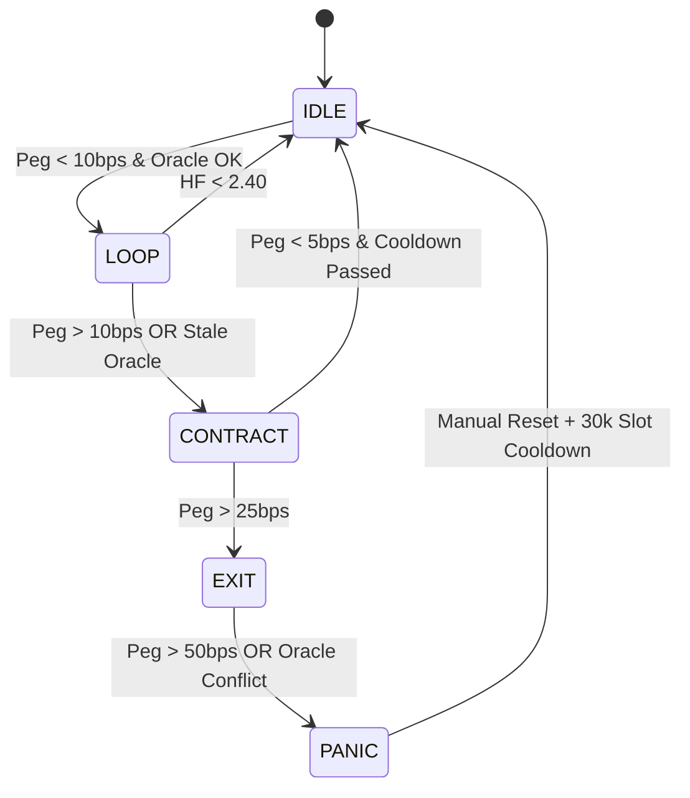

# PRD: Immutable Solana Algo-Stable Carry

**Version**: 1.0  
**Last Updated**: 2026-02-11  
**Status**: Production-Ready Blueprint

---

## 1. Project Overview

### Goal
Build a "Set-and-Forget" delta-neutral yield optimizer on Solana that loops stablecoins to earn interest while being governed by an **immutable on-chain state machine** that aggressively unwinds positions if the stablecoin depegs or oracles become unreliable.

### Core Philosophy
> **Discretion is a bug.** The protocol only moves between states based on hard-coded mathematical thresholds.

### Value Proposition
- **For Users**: Earn 5-12% APY on stablecoins without active monitoring
- **For Keepers**: Earn fees by maintaining system health through permissionless rebalancing
- **For DeFi**: Demonstrate that algorithmic risk management can be more reliable than human governance

---

## 2. Target User Personas

### Primary: The Passive Yield Seeker
- **Profile**: Holds $10k-$500k in stablecoins
- **Goal**: Earn yield higher than base lending (3-5%) without 24/7 monitoring
- **Pain Point**: Doesn't trust algorithmic stablecoins but wants better returns than USDC on Aave
- **Success Metric**: "I can sleep at night knowing the system will protect my capital"

### Secondary: The Keeper
- **Profile**: Bot operator or yield farmer
- **Goal**: Earn small fees (0.1-0.5% of rebalanced amount) by calling `rebalance_step`
- **Pain Point**: Needs clear profit signals to justify gas costs
- **Success Metric**: Profitable keeper operations with >80% success rate

### Tertiary: The DeFi Researcher
- **Profile**: Protocol designer or auditor
- **Goal**: Study immutable state machine design patterns
- **Pain Point**: Most "algorithmic" protocols have governance backdoors
- **Success Metric**: Verifiable on-chain immutability

---

## 3. Functional Specifications

### 3.1 Vault Operations

#### Deposit
```
User Action: Deposit Base Stable (USDC, USDH, or approved stable)
Input: Amount in base stable
Output: Vault shares (proportional to equity)
Constraints: 
  - Minimum deposit: 100 USDC
  - Maximum deposit: None (but UI warns if >10% of TVL)
```

#### Withdraw
```
User Action: Burn vault shares to receive equity portion
Input: Number of shares to burn
Output: Base stable (current equity value)
Constraints:
  - Withdrawals are ALWAYS prioritized (even in PANIC state)
  - May receive less than deposited if vault is in loss
  - Cooldown: None (instant liquidity)
```

#### Rebalance (Permissionless)
```
Keeper Action: Trigger state machine transition
Input: None (reads on-chain state)
Output: State transition + keeper fee
Constraints:
  - Must respect COOLDOWN_SLOTS (30,000 slots = ~4 hours)
  - Max 1.4M Compute Units per transaction
  - May require multiple transactions for full unwind
```

---

### 3.2 The State Machine (The "Brain")

The app must monitor and display these states based on on-chain data:

| State | Action | Trigger Condition | UI Color |
|-------|--------|-------------------|----------|
| **IDLE** | Hold 70% in Lending, 30% Buffer | Default state / Post-Cooldown | 🟢 Green |
| **LOOP** | Leverage up to 1.50x | Peg < 10bps deviation AND Oracle Healthy | 🔵 Blue |
| **CONTRACT** | Repay debt, stop re-expansion | Peg > 10bps deviation OR Oracle Staleness | 🟡 Yellow |
| **EXIT** | Unwind all loops to 1x leverage | Peg > 25bps deviation | 🟠 Orange |
| **PANIC** | Freeze all new CPI; only safe repayment | Peg > 50bps OR Oracle Disagreement | 🔴 Red |

#### State Transition Rules



---

## 4. Technical Constraints (For Engineer/AI)

### 4.1 On-Chain Guardrails (Hard-Coded Constants)

```rust
// Leverage Constraints
const MAX_LEVERAGE: f64 = 1.50;           // Equity / Total Position
const HF_FLOOR: f64 = 2.40;               // Health Factor minimum
const TARGET_BUFFER: f64 = 0.30;          // 30% cash reserve in IDLE

// Oracle Safety
const ORACLE_STALE_SLOTS: u64 = 150;      // ~60 seconds
const ORACLE_DISAGREEMENT_BPS: u64 = 15;  // Pyth vs Switchboard max delta

// Peg Thresholds (basis points from $1.00)
const PEG_WARN_BPS: u64 = 10;             // 0.10% → CONTRACT
const PEG_EXIT_BPS: u64 = 25;             // 0.25% → EXIT
const PEG_PANIC_BPS: u64 = 50;            // 0.50% → PANIC

// Cooldowns
const REEXPANSION_DELAY: u64 = 30_000;    // ~4 hours after depeg
const COOLDOWN_SLOTS: u64 = 30_000;       // Between state changes
```

### 4.2 Integrated Protocols

| Component | Primary | Fallback | Rationale |
|-----------|---------|----------|-----------|
| **Lending** | Kamino | Save Finance | Higher liquidity, better oracle integration |
| **Oracles** | Pyth + Switchboard | Dual-feed required | Manipulation resistance |
| **DEX** | Orca (CLMM) | Meteora | Lowest slippage for stable swaps |
| **Compute** | 1.4M CU limit | Split transactions if needed | 3 positions per tx |

### 4.3 Compute Unit Budget

Based on Monte Carlo simulation results:

```
Operation Breakdown:
- Oracle Fetch (Pyth + Switchboard): 200k CU
- Health Factor Calculation: 100k CU
- Swap (Orca): 400k CU
- Lend/Borrow (Kamino): 400k CU
- State Update: 50k CU
---
Total per rebalance: ~1.15M CU (within 1.4M limit)
```

**Strategy**: If unwinding >3 positions, split into multiple transactions.

---

## 5. UI/UX Requirements (For Lovable/AI Generation)

### 5.1 Dashboard View (Primary Screen)

#### Header Section
```
┌─────────────────────────────────────────────────┐
│  🛡️ Aegis Stable Carry                          │
│  Current State: [LOOP] 🔵                       │
│  TVL: $1,247,392  |  Your Position: $12,450    │
└─────────────────────────────────────────────────┘
```

#### Health Metrics Panel
```
┌─────────────────────────────────────────────────┐
│  📊 System Health                               │
├─────────────────────────────────────────────────┤
│  Live Peg:        $0.9998  ✅ (2 bps)          │
│  Health Factor:   3.12 / 2.40 ✅                │
│  Leverage:        1.42x / 1.50x                 │
│  Oracle Status:   Fresh (12 slots ago) ✅       │
│  Next Rebalance:  Available Now                 │
└─────────────────────────────────────────────────┘
```

#### State Badge (Prominent, Color-Coded)
- **LOOP** (🔵 Blue): "Actively Earning - All Systems Normal"
- **CONTRACT** (🟡 Yellow): "Reducing Risk - Peg Deviation Detected"
- **EXIT** (🟠 Orange): "Emergency Unwind - Significant Depeg"
- **PANIC** (🔴 Red): "System Frozen - Manual Intervention Required"

#### Keeper Action Button
```
┌─────────────────────────────────────────────────┐
│  ⚡ Keeper Actions                              │
├─────────────────────────────────────────────────┤
│  [Trigger Rebalance]  ← Active when needed      │
│  Estimated Fee: 0.15% (~$18.67)                 │
│  Gas Cost: ~0.02 SOL                            │
└─────────────────────────────────────────────────┘
```

### 5.2 Wallet Integration

#### Connect Flow
1. Click "Connect Wallet"
2. Select Phantom/Solflare/Backpack
3. Approve connection
4. Display user's vault shares + equity

#### Deposit Flow
```
┌─────────────────────────────────────────────────┐
│  💰 Deposit                                     │
├─────────────────────────────────────────────────┤
│  Amount: [_______] USDC                         │
│  Balance: 5,420.00 USDC                         │
│                                                  │
│  You will receive: ~5,420 shares                │
│  Current APY: 8.4%                              │
│                                                  │
│  [Deposit USDC]                                 │
└─────────────────────────────────────────────────┘
```

#### Withdraw Flow
```
┌─────────────────────────────────────────────────┐
│  💸 Withdraw                                    │
├─────────────────────────────────────────────────┤
│  Shares: [_______]                              │
│  Your Shares: 12,450                            │
│                                                  │
│  You will receive: ~12,398 USDC                 │
│  (Current equity per share: 0.9958)             │
│                                                  │
│  ⚠️ Vault is in CONTRACT state                  │
│  Withdrawals are always honored                 │
│                                                  │
│  [Withdraw]                                     │
└─────────────────────────────────────────────────┘
```

### 5.3 Advanced Metrics (Collapsible Section)

```
┌─────────────────────────────────────────────────┐
│  📈 Advanced Metrics                            │
├─────────────────────────────────────────────────┤
│  Total Supplied:     $1,872,588                 │
│  Total Borrowed:     $625,196                   │
│  Equity:             $1,247,392                 │
│  Actual Leverage:    1.50x                      │
│                                                  │
│  Oracle Prices:                                 │
│    Pyth:      $0.99982                          │
│    Switchboard: $0.99979                        │
│    Deviation: 3 bps ✅                           │
│                                                  │
│  Last Rebalance: 2,341 slots ago (~15 min)     │
│  Cooldown Remaining: 0 slots                    │
└─────────────────────────────────────────────────┘
```

---

## 6. Logic & Calculations (Prompt-Ready Code)

### 6.1 State Determination Logic

```typescript
interface VaultState {
  peg: number;           // Price in USD
  oracleStale: boolean;  // Slots since last update > 150
  oracleConflict: boolean; // Pyth vs Switchboard > 15bps
  healthFactor: number;  // Collateral / Debt ratio
  leverage: number;      // Total Supplied / Equity
}

const getVaultState = (state: VaultState): string => {
  const pegBps = Math.abs(state.peg - 1.0) * 10000;
  
  // PANIC: Oracle failure or severe depeg
  if (state.oracleStale || state.oracleConflict || pegBps > 50) {
    return "PANIC";
  }
  
  // EXIT: Significant depeg
  if (pegBps > 25) {
    return "EXIT";
  }
  
  // CONTRACT: Warning level depeg or HF risk
  if (pegBps > 10 || state.healthFactor < 2.40) {
    return "CONTRACT";
  }
  
  // LOOP: All systems normal
  if (pegBps < 10 && state.healthFactor >= 2.40) {
    return "LOOP";
  }
  
  // Default: IDLE
  return "IDLE";
};
```

### 6.2 Equity & Leverage Calculations

```typescript
interface VaultMetrics {
  totalSupplied: number;   // Total assets in lending protocol
  totalBorrowed: number;   // Total debt
  totalShares: number;     // Vault shares outstanding
}

const calculateMetrics = (vault: VaultMetrics) => {
  const equity = vault.totalSupplied - vault.totalBorrowed;
  const leverage = vault.totalSupplied / equity;
  const pricePerShare = equity / vault.totalShares;
  
  return {
    equity,
    leverage,
    pricePerShare,
    utilizationRate: vault.totalBorrowed / vault.totalSupplied
  };
};
```

### 6.3 Keeper Profitability Check

```typescript
const isKeeperProfitable = (
  rebalanceAmount: number,
  feePercent: number,
  solPrice: number,
  priorityFee: number
): boolean => {
  const rewardUSD = rebalanceAmount * (feePercent / 100);
  const gasCostUSD = (0.000005 + priorityFee) * solPrice; // Base + priority
  
  return rewardUSD > gasCostUSD * 1.5; // 50% profit margin
};
```

---

## 7. Stress Test Scenarios (Validation Cases)

### 7.1 The "Solend Incident" (Oracle Manipulation)

**Scenario**: Attacker manipulates thin DEX pool to create false oracle price.

**Expected Behavior**:
1. Pyth reports $1.00, Switchboard reports $0.985 (15+ bps disagreement)
2. State machine detects `oracleConflict = true`
3. Immediately enters **PANIC** state
4. Freezes all new leverage expansion
5. Only allows debt repayment CPIs

**UI Display**:
```
🔴 PANIC MODE
Oracle Conflict Detected
Pyth: $1.0000 | Switchboard: $0.9850
System frozen - awaiting oracle consensus
```

### 7.2 Flash Depeg (USDC March 2023 Style)

**Scenario**: Stablecoin drops to $0.98 due to banking crisis news.

**Expected Behavior**:
1. Peg deviation = 200 bps (> 50 bps threshold)
2. State machine enters **PANIC**
3. Begins emergency unwind (3 positions per tx)
4. Completes unwind in ~5 blocks (2 seconds) per Monte Carlo simulation
5. Final leverage: 1.0x (no debt)

**UI Display**:
```
🔴 PANIC MODE
Severe Depeg: $0.9800 (-200 bps)
Emergency unwind in progress...
Progress: [████████░░] 80% (8/10 positions closed)
```

### 7.3 Network Congestion (Slots Pass, No Oracle Update)

**Scenario**: Solana network congestion prevents oracle updates for 200 slots.

**Expected Behavior**:
1. Last oracle update: 200 slots ago (> 150 threshold)
2. State machine detects `oracleStale = true`
3. Enters **CONTRACT** state (not PANIC, as price is still reasonable)
4. Stops new leverage, begins gradual unwind
5. Waits for oracle to refresh

**UI Display**:
```
🟡 CONTRACT MODE
Oracle Stale (200 slots since update)
Reducing leverage as precaution
Last Price: $0.9998 (60 seconds ago)
```

---

## 8. Deployment Strategy

### 8.1 Pre-Deployment Checklist

- [ ] Solana Verifiable Build completed
- [ ] Anchor program audit by OtterSec/Neodyme
- [ ] Monte Carlo simulation validates <1% loss in 99th percentile
- [ ] Testnet deployment with 1000+ simulated rebalances
- [ ] Keeper bot tested in adversarial conditions
- [ ] UI/UX tested with 10+ beta users

### 8.2 Immutability Process

```bash
# Step 1: Deploy to mainnet with upgrade authority
anchor deploy --provider.cluster mainnet

# Step 2: Verify on-chain code matches source
solana-verify verify-from-repo \
  --program-id <PROGRAM_ID> \
  --mount-path . \
  --library-name aegis_carry

# Step 3: Set upgrade authority to None (IRREVERSIBLE)
solana program set-upgrade-authority <PROGRAM_ID> --final

# Step 4: Verify immutability
solana program show <PROGRAM_ID>
# Should show: "Upgrade Authority: none"
```

### 8.3 UI Warning (CRITICAL)

The UI **MUST** display this disclaimer prominently:

```
⚠️ PERMANENT CODE WARNING

This vault is governed by IMMUTABLE smart contracts.
The code CANNOT be upgraded or patched.

If a dependency (Kamino, Pyth, etc.) fails or migrates,
this vault may become permanently stuck.

Only deposit funds you can afford to lose.

[I Understand - Proceed] [Cancel]
```

---

## 9. Success Metrics (KPIs)

### Launch (Month 1)
- TVL: $500k+
- Unique depositors: 50+
- Zero critical bugs
- Average APY: 6-10%

### Growth (Month 3)
- TVL: $5M+
- Keeper network: 5+ active bots
- State transitions: 100+ successful rebalances
- Zero PANIC events (or <2 with successful recovery)

### Maturity (Month 6)
- TVL: $20M+
- Average user hold time: 90+ days
- Keeper profitability: 80%+ of rebalances profitable
- Community forks: 2+ protocols using the state machine design

---

## 10. Open Questions & Future Enhancements

### Open Questions
1. **Base Stable Selection**: Should we support multiple base stables (USDC, USDH, PYUSD) or just one?
2. **Keeper Incentives**: Fixed fee (0.1%) or dynamic based on risk?
3. **Emergency Governance**: Should there be a 7-of-10 multisig that can trigger PANIC manually?

### Future Enhancements (V2, Separate Deployment)
- **Dynamic HF Floor**: Adjust based on DEX liquidity depth
- **Multi-Asset Support**: Loop SOL/stSOL instead of just stables
- **Cross-Program Composability**: Allow other protocols to deposit on behalf of users
- **Keeper Reputation System**: Prioritize reliable keepers with lower fees

---

## 11. Appendix: Reference Implementation

### File Structure
```
aegis-carry/
├── programs/
│   └── aegis-carry/
│       ├── src/
│       │   ├── lib.rs              # Program entry
│       │   ├── state.rs            # State machine logic
│       │   ├── instructions/
│       │   │   ├── deposit.rs
│       │   │   ├── withdraw.rs
│       │   │   └── rebalance.rs
│       │   └── constants.rs        # Hard-coded guardrails
├── app/
│   ├── components/
│   │   ├── Dashboard.tsx
│   │   ├── StateIndicator.tsx
│   │   └── KeeperButton.tsx
│   └── hooks/
│       ├── useVaultState.ts
│       └── useOraclePrice.ts
└── tests/
    ├── monte_carlo.py              # Simulation script
    └── integration.ts              # On-chain tests
```

### Key Dependencies
```json
{
  "dependencies": {
    "@coral-xyz/anchor": "^0.29.0",
    "@solana/web3.js": "^1.87.0",
    "@pythnetwork/client": "^2.19.0",
    "switchboard-v2": "^0.4.0"
  }
}
```

---

**End of PRD**

*This document is optimized for AI app builders (Lovable, v0, Cursor) and provides all necessary context to generate a production-ready Solana vault interface.*
